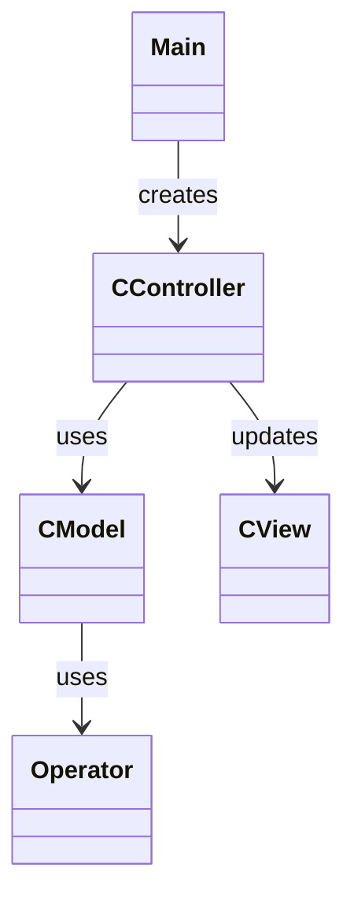
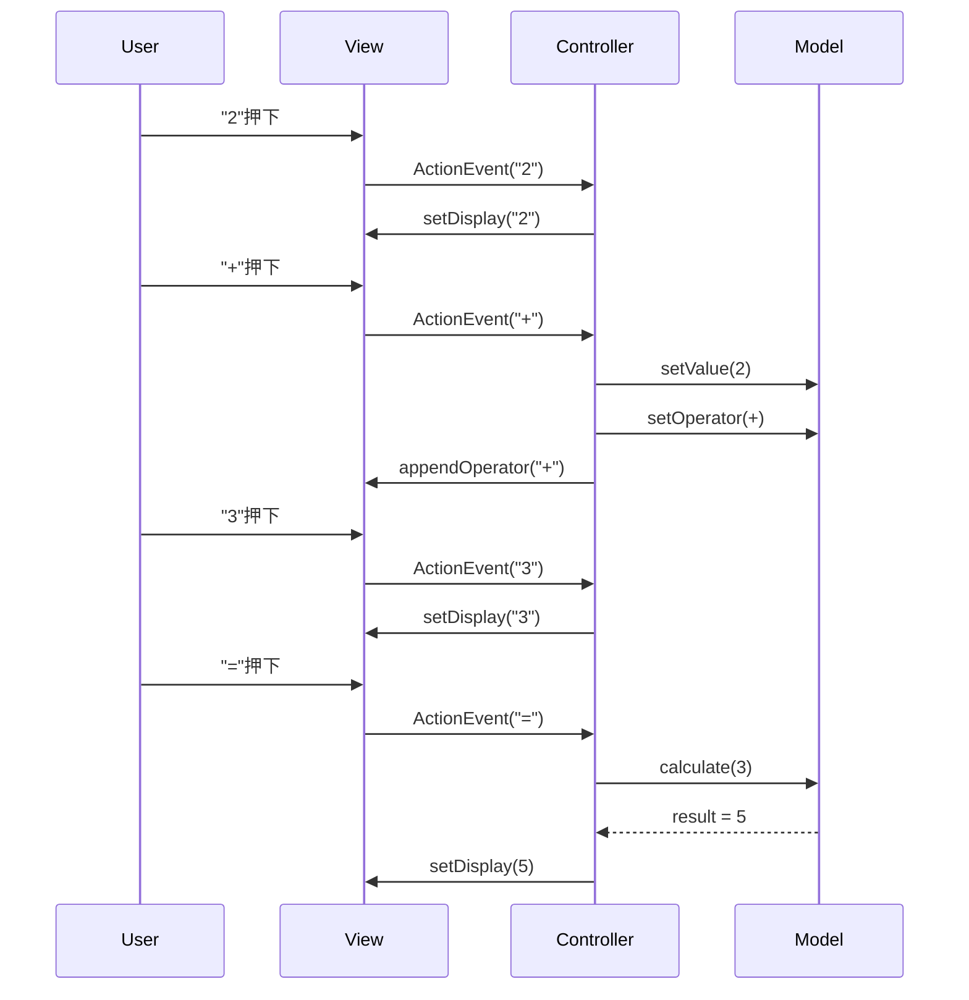

# Calculator

Swingで開発した電卓アプリです。  
Javaのアプリケーション開発の基礎を学ぶことを目的とし、以下を意識して実装しています。  
- MVC（Model-View-Controller）による責務分離
- enum + Strategy による演算ロジックの抽象化
- 状態管理（State的アプローチ）による入力制御

---

## ■ 主な機能

- 四則演算（+ / - / * / /）
- 数値入力（複数桁対応）
- 演算子の表示（例：12 +）
- 演算子の上書き（+ → - など）
- 小数表示の最適化（10.0 → 10）
- 不正な = 入力の抑制（状態制御）
- クリア機能（C）

---

## ■ パッケージ構成

```text
CMain                  // アプリケーションのエントリーポイント

controller
└─ CController         // 入力制御、状態管理

model
├─ CModel              // 計算状態と計算ロジックを管理
└─ Operator            // 演算子と計算定義

view
└─ CView               // 画面全体の構成
```

---

## ■ クラス図


---

## ■ シーケンス図（２＋３＝）



---

## ■ 今後の改善

- 小数入力対応（.）
- バックスペース機能
- 0除算エラー処理
- UI改善（レイアウト・余白・色）
- 表示と内部状態の完全分離（View改善）

---

## ■ 学習ポイント

- MVC設計
- enum + Strategyパターン
- 状態遷移

